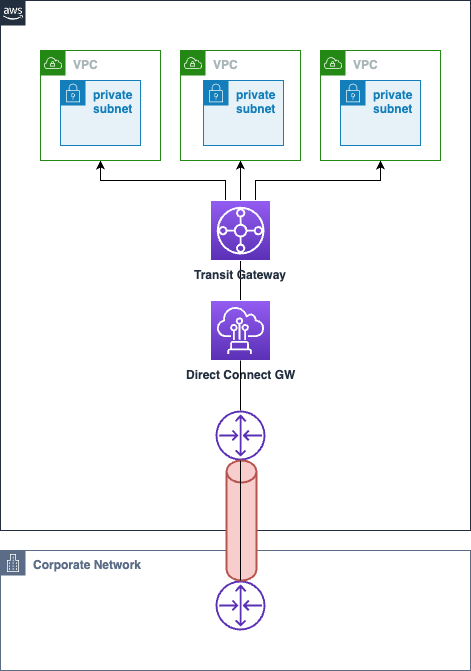
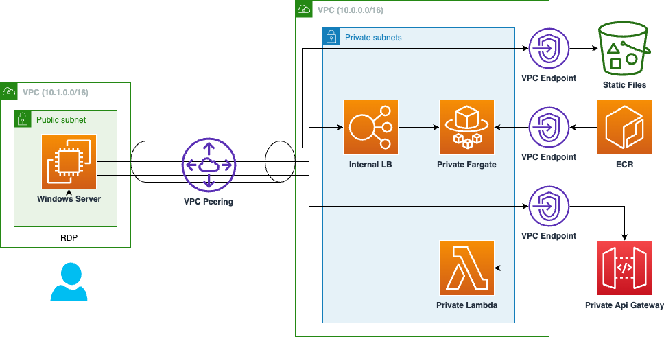
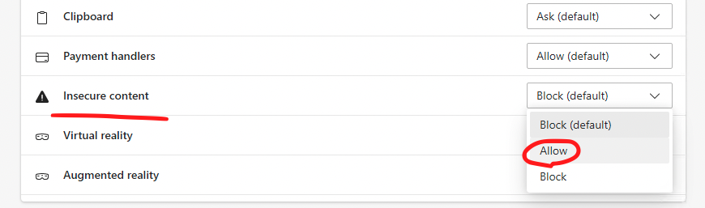
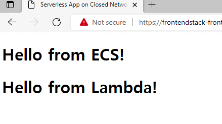

# Serverless application on closed network

日本語版は[こちら](docs/README_ja.md)

## About

This is a sample of configuring a serverless web application in a closed network.

## Background

Although it has been a long time since zero-trust security models were introduced, perimeter security is still the mainstream in enterprise environments where firewalls are installed at the boundaries between internal and external networks to protect against unauthorized access from the outside. While outbound communication from the internal network to the Internet via a proxy is permitted, inbound communication from the Internet to the company intranet is strictly prohibited, and access from clients to servers via the Internet is sometimes not permitted.

Due to the above restrictions, when building a system on AWS that requires integration with existing in-house systems, a closed network using [AWS Direct Connect](https://aws.amazon.com/directconnect/) may be configured in some cases. In the case of a serverless configuration on a closed network, a configuration using PrivateLink is required.



This repository is intended to serve as a reference for configuring a serverless 3-tier application in a closed network environment as described above.

## Architecture



- Frontend
  - Deliver index.html from S3
- Backend
  - Following two independent configurations are available
    - API Gateway + Lambda
    - Fargate (ECS)
- Verrification
  - Prepare a public windows instance on the peering VPC for verification and try to connect to the application.
  - The above VPC is assumed to be other VPCs connected by Transit Gateway, internal networks, etc.

## Deploy

Install npm modules.

```
npm install
```

Deploy using [CDK](https://aws.amazon.com/cdk/).

```
npx cdk bootstrap
npx cdk deploy ServerlessAppOnClosedNetworkStack --require-approval never
npx cdk deploy FrontendStack --require-approval never
```

Note the value of `FrontendUrl` obtained after the above deployment. e.g.

```
https://frontendstack-frontends3appbucketbdb1387d-149aqmjiemf0g.bucket.vpce-xxxxxxxxxxx-yyyyyyyyy.s3.ap-northeast-1.vpce.amazonaws.com/index.html
```

Deploy verification stack via following command:

```
npx cdk deploy TestStack --require-approval never
```

Note the value of `GetSSHKeyCommand` obtained after the above deployment. e.g.

```
aws ssm get-parameter --name /ec2/keypair/key-xxxxxxxxxxxxxxx --region ap-northeast-1 --with-decryption --query Parameter.Value --output text
```

## Verification

Execute the `GetSSHKeyCommand` that you have noted down and copy the resulting output to the clipboard.

From the management console, select `Connect` to Windows instance (Name: TestStack/WindowsInstance), download the RDP file and execute it. The Administrator password can be obtained by clicking on `Get password` and pasting the result of the above command.


Launch an Edge browser in the RDP environment and access the URL you have noted with `FrontendUrl`. In this sample, the Application Load Balancer is not https, but http, so you need to allow access from the browser. First, click the key mark on the left of the address bar and click `Permissions for this site`.


Choose Allow for `Insecure content`.



You will see the following screen.  


## Security

See [CONTRIBUTING](CONTRIBUTING.md#security-issue-notifications) for more information.

## License

This library is licensed under the MIT-0 License. See the LICENSE file.
