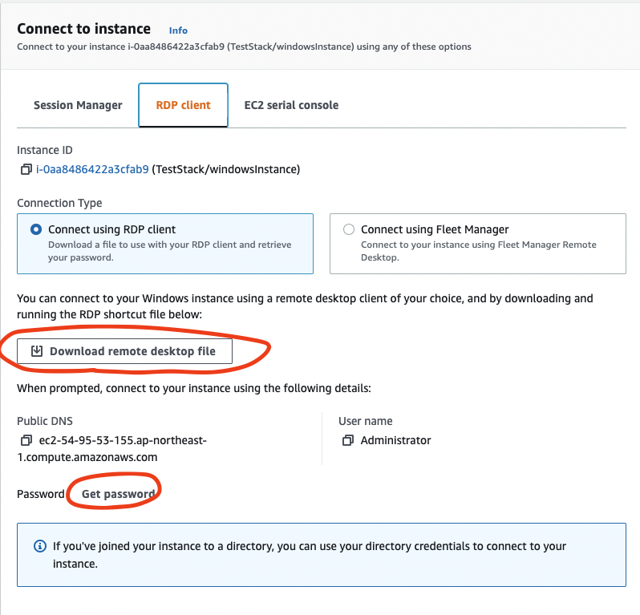

# Serverless application on closed network

## このリポジトリについて

閉域ネットワーク内にサーバレスな web アプリケーションを構成するサンプルです。  
別途[Blog](https://aws-samples.github.io/jp-prototyping-blog/closed-serverless-app/)も併せてご参照ください。

## 背景

ゼロトラストによるセキュリティ対策が登場してから久しい昨今ですが、主にエンタープライズ環境においてはまだ境界型セキュリティが主流であり、社内ネットワークと外部ネットワークとの境界線に、ファイアウォールなどを設置し外部からの不正アクセスに対し防御しています。プロキシを経由し社内ネットワークからインターネットへ出る outbound の通信は許可されている一方で、インターネットから社内イントラへの inboud は厳禁など、クライアントからインターネット経由でのサーバへのアクセスは許可されていないことがあります。

上記の制約のため、既存の社内システムと連携が必要なシステムを AWS 上に構築する場合、[AWS Direct Connect](https://aws.amazon.com/jp/directconnect/)による閉域ネットワークが構成されるケースがあります。閉域ネットワーク上でサーバレスな構成をとる場合、PrivateLink を用いた構成が必要となります。


本リポジトリは上記のような閉域環境下にてサーバレスな３層アプリを構成する上で参考となることを目指して作られたものです。

## アーキテクチャ


- フロントエンド
  - index.html を S3 から配信
- バックエンド
  - サンプルとして独立した下記二つの構成を用意
    - API Gateway + Lambda
    - Fargate (ECS)
- 検証
  - 検証用として peering した VPC 上に public な windows インスタンスを用意しアプリへの接続を試みる
  - 上記 VPC は Transit Gateway によって接続された他 VPC のほか、社内ネットワークなどを想定

## デプロイ手順

npm モジュールをインストールします。

```
npm install
```

[CDK](https://aws.amazon.com/jp/cdk/)によりデプロイします。

```
npx cdk bootstrap
npx cdk deploy ServerlessAppOnClosedNetworkStack --require-approval never
npx cdk deploy FrontendStack --require-approval never
```

上記デプロイ後に得られる`FrontendUrl`の値を控えておきます。例：

```
https://frontendstack-frontends3appbucketbdb1387d-149aqmjiemf0g.bucket.vpce-xxxxxxxxxxx-yyyyyyyyy.s3.ap-northeast-1.vpce.amazonaws.com/index.html
```

検証環境をデプロイします。

```
npx cdk deploy TestStack --require-approval never
```

上記デプロイ後に得られる`GetSSHKeyCommand`の値を控えておきます。例：

```
aws ssm get-parameter --name /ec2/keypair/key-xxxxxxxxxxxxxxx --region ap-northeast-1 --with-decryption --query Parameter.Value --output text
```

## 検証

控えておいた`GetSSHKeyCommand`を実行し、得られた出力をクリップボードにコピーします。

マネージメントコンソールから Windows インスタンス（Name: TestStack/WindowsInstance）に接続を選択し、RDP ファイルをダウンロード後実行します。Administrator のパスワードは`Get password`をクリックし上述のコマンド結果をペーストすることで得ることができます。



RDP 環境で Edge ブラウザを立ち上げ、`FrontendUrl`で控えた URL にアクセスします。このサンプルでは Application Load Balancer は https ではなく http のため、ブラウザ側からアクセスを許可してあげる必要があります。まずアドレスバー左の鍵マークをクリックし、`Permissions for this site`をクリックします。


`Insecure content`の Allow を選択します。


下記のような画面が表示されれば成功です。  

